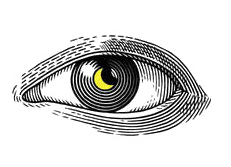
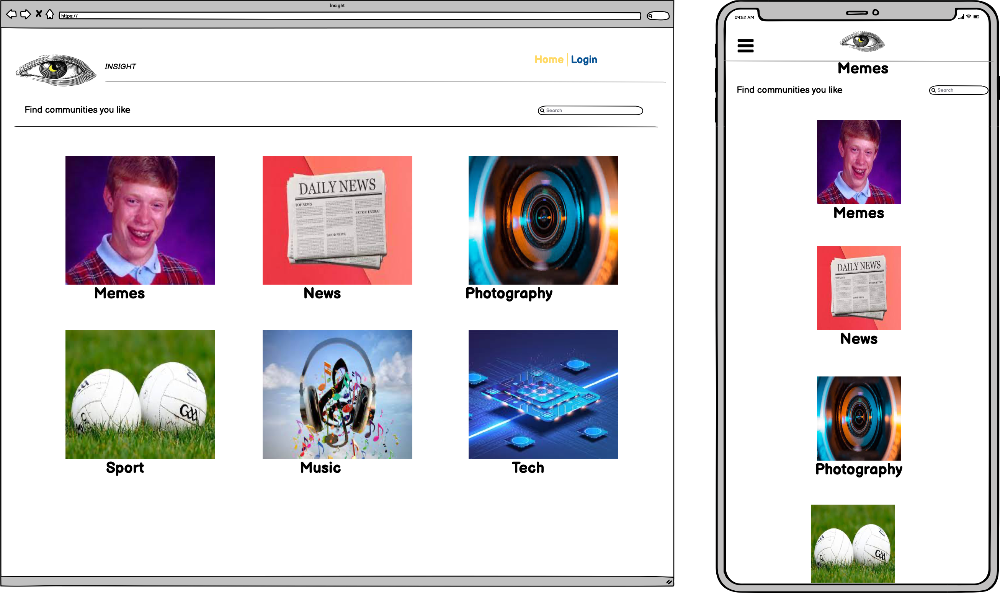
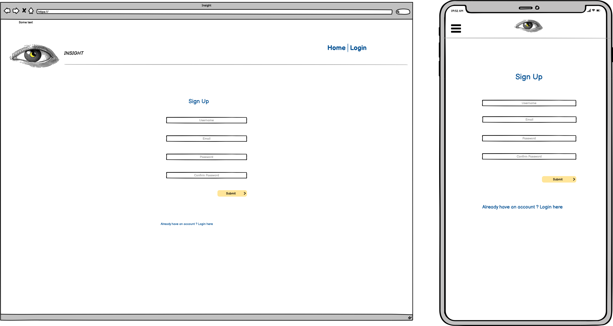
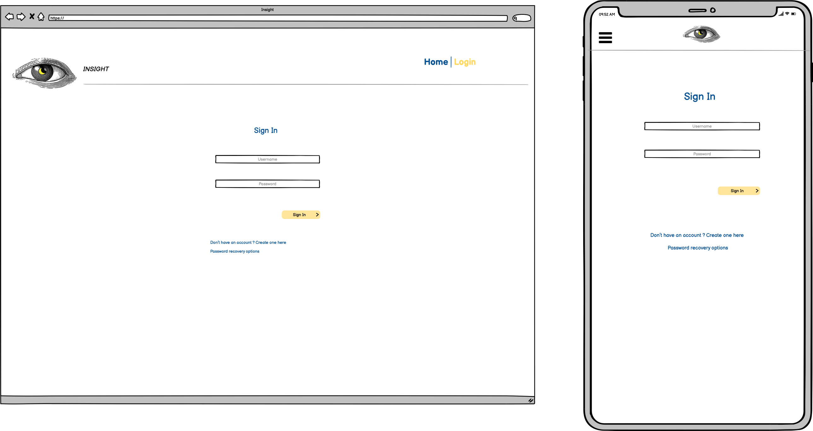
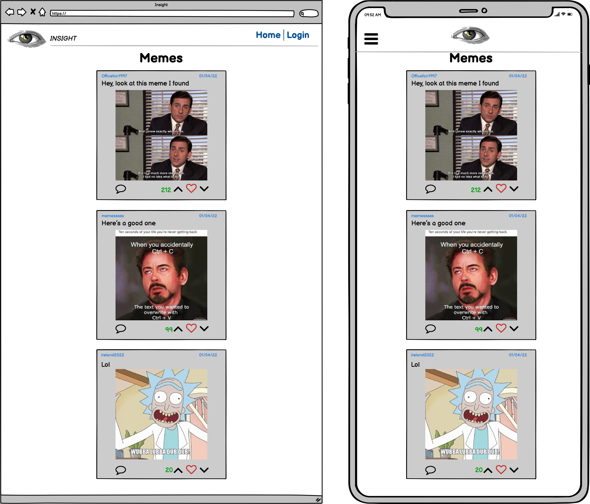
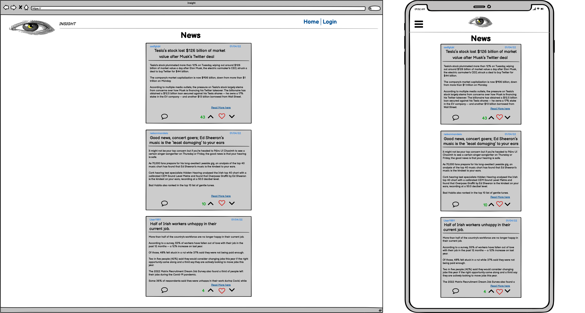
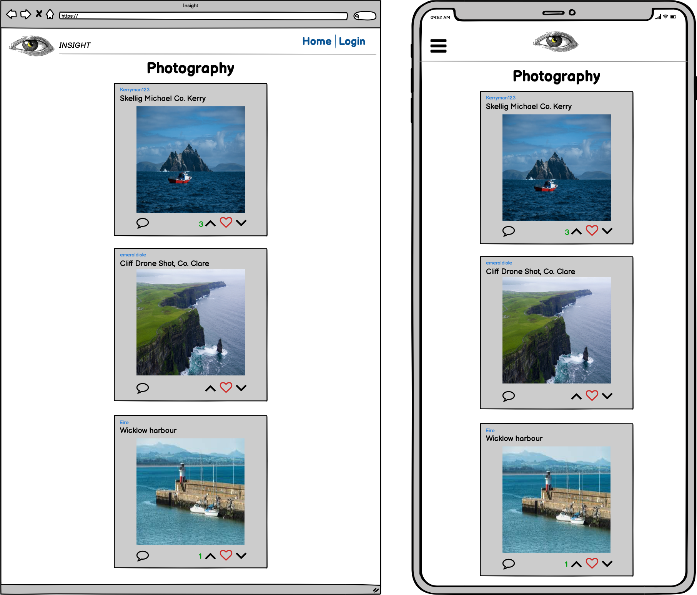
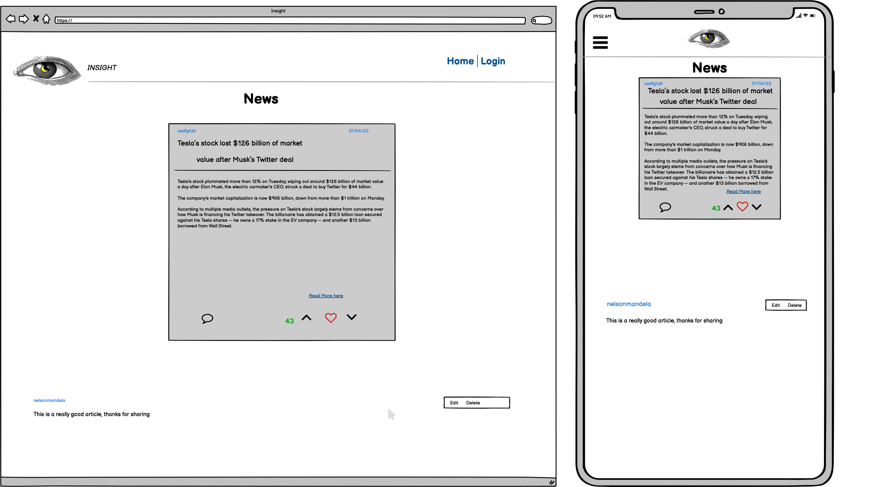
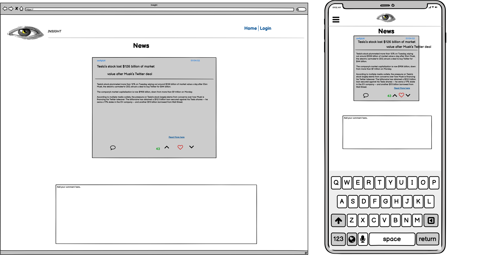
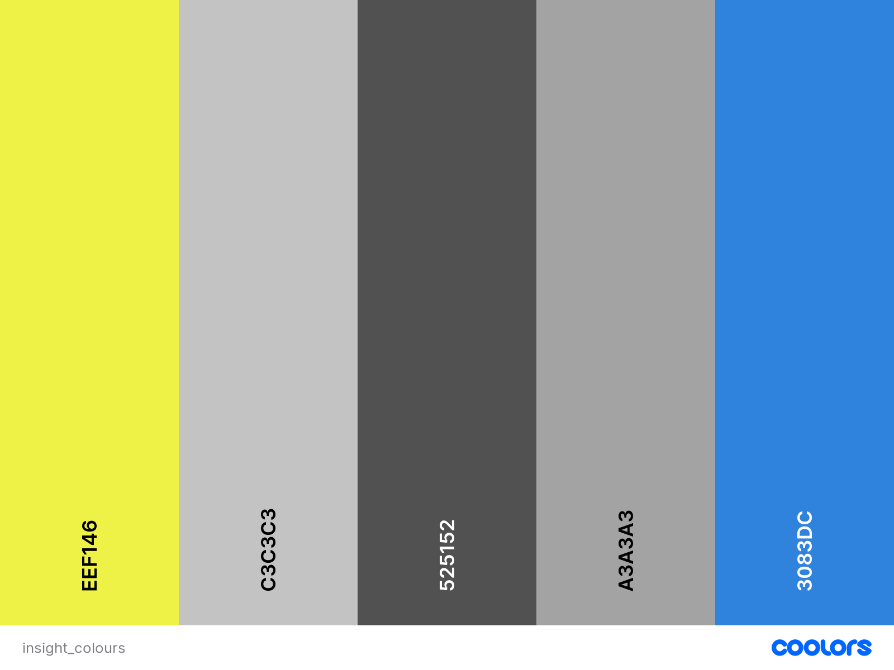

<h1 align="center">Insight - News Website</h1>

This is a Reddit style news site with different hubs for different topics

<h2 align="center"></h2>

## User Experience (UX)
 

-   ### User Stories
    -   #### First Time Visitor Goals  

        1. As a First Time Visitor, I want to be able to view a list of posts so i can select one to read.
        2. As a First Time Visitor, I want to be able to view the number of likes so i can see how popular a post is.
        3. As a First Time Visitor, I want to be able to create an account on the website.
        4. As a First Time Visitor, I want to be able to like and comment on posts.
        5. As a First Time Visitor, I want to be able to unlike and edit/delete my comment on posts.
        

    -   #### Returning Visitor Goals

        1. As a Returning Visitor, I want to be able to log in to my account.
        2. As a Returning Visitor, I want to see if there are any newly added posts.
        3. As a Returning Visitor, I want to be able to create posts.

    -   #### Frequent Visitor Goals

        1. As a Frequent Visitor, I want to be able to log in to my account.
        1. As a Frequent Visitor, I want to see if there are any newly added posts.
        1. As a Frequent Visitor, I want to be able to create new posts.
        1. As a Frequent Visitor, check how popular my posts have gotten.

## Planning and Design 
 

## Wireframes
The wireframes were created using [Balsamiq](https://balsamiq.com/).

    
Click here to see wireframes.

     

    
Homepage

    

    
Sign Up

    

    
Sign In

    

    
Memes

    

    
News

    

    
Photography

    

    
Comment Options

    

    
Comments

    

 

## Logo
The Logo was taken from [webhostingsecretrevealed](https://www.webhostingsecretrevealed.net/blog/web-design/free-beautiful-logos/).

    
View Logo

    

 

## Colour Scheme
The colour palette was generated on [Coolers](https://coolors.co/).

    
View Colour Palette

    

## Features

- Responsive on all devices.
- Interactive elements

## Technologies Used 

### Languages Used

### Frameworks, Libraries and Programs used

## Testing

## Bugs

## Deployment

## Credits

