<h1 align="center">Insight - News Website</h1>

This is a Reddit style news site for all things GAA related

<h2 align="center"></h2>
<h2 align="center">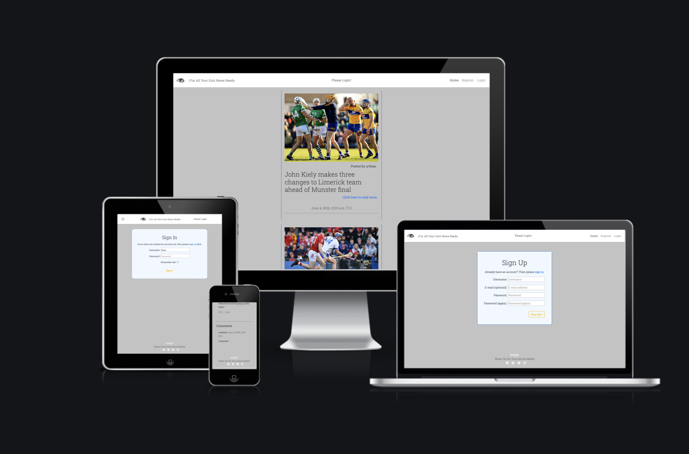</h2>

## User Experience (UX)
 

-   ### User Stories
    -   #### First Time Visitor Goals  

        1. As a First Time Visitor, I want to be able to view a list of posts so i can select one to read.
        2. As a First Time Visitor, I want to be able to view the number of likes so i can see how popular a post is.
        3. As a First Time Visitor, I want to be able to create an account on the website.
        4. As a First Time Visitor, I want to be able to like and comment on posts.
        5. As a First Time Visitor, I want to be able to unlike and edit/delete posts.
        

    -   #### Returning Visitor Goals

        1. As a Returning Visitor, I want to be able to log in to my account.
        2. As a Returning Visitor, I want to see if there are any newly added posts.
        3. As a Returning Visitor, I want to be able to create posts.

    -   #### Frequent Visitor Goals

        1. As a Frequent Visitor, I want to be able to log in to my account.
        1. As a Frequent Visitor, I want to see if there are any newly added posts.
        1. As a Frequent Visitor, I want to be able to create new posts.
        1. As a Frequent Visitor, check how popular my posts have gotten.

    -   #### Site Maintainer / Admin Goals

        1. As an Admin of the site i want to be able to see how many users have accounts.
        2. As an Admin of the site i want to be able to see all posts and comments.
        3. As an admin of the site i want to be able to edit delete any posts or comments by any user.

## Planning and Design 
 

## Wireframes
The wireframes were created using [Balsamiq](https://balsamiq.com/).

    
Click here to see wireframes.

     

    
Homepage

    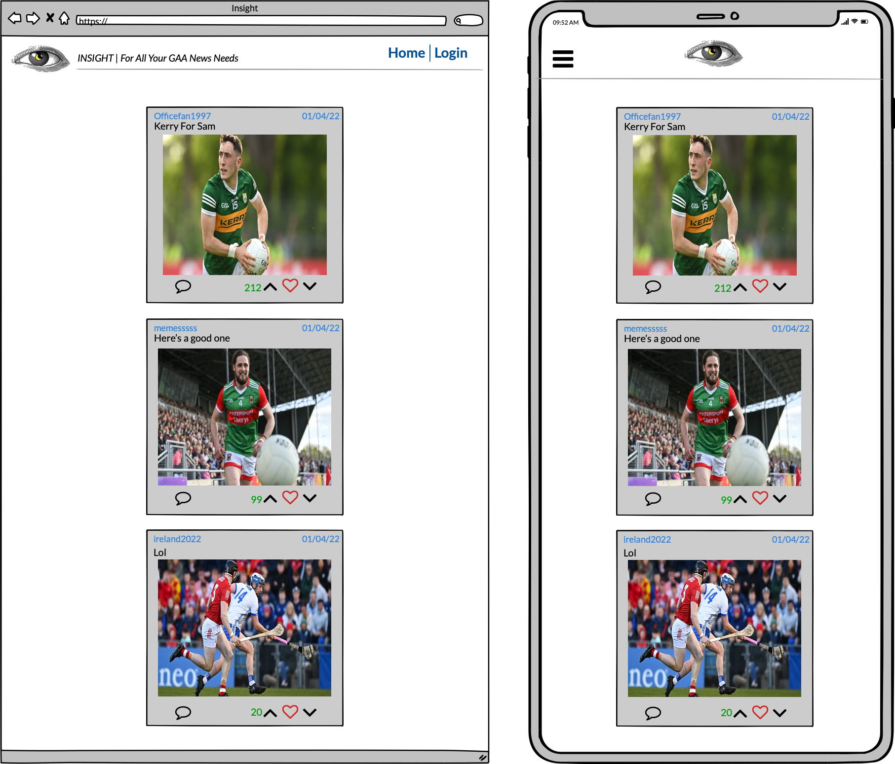

    
Sign Up

    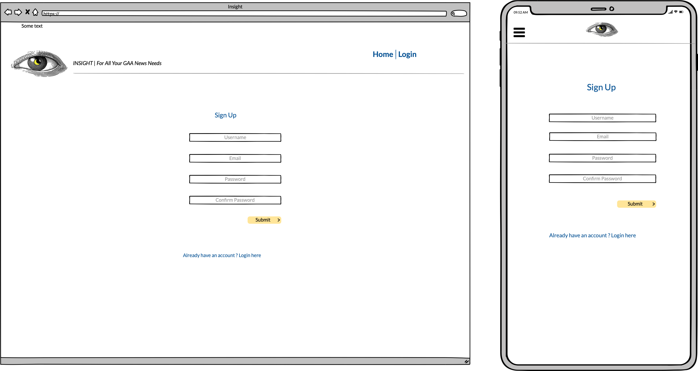

    
Sign In

    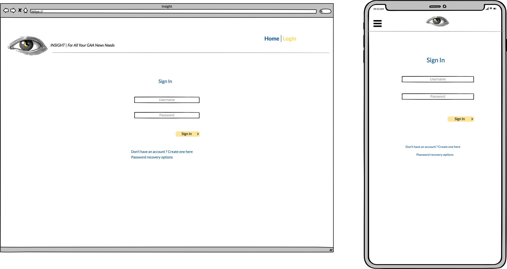

    
Post Detail

    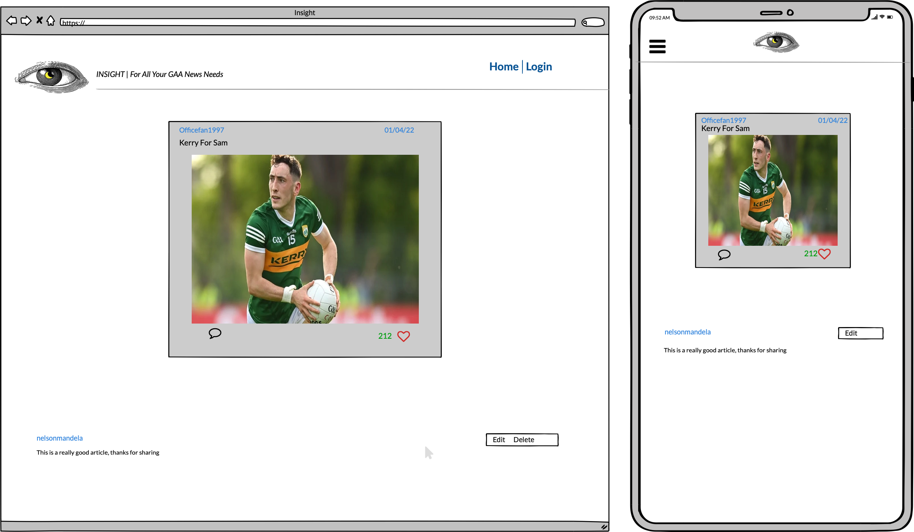

    
Edit Post

    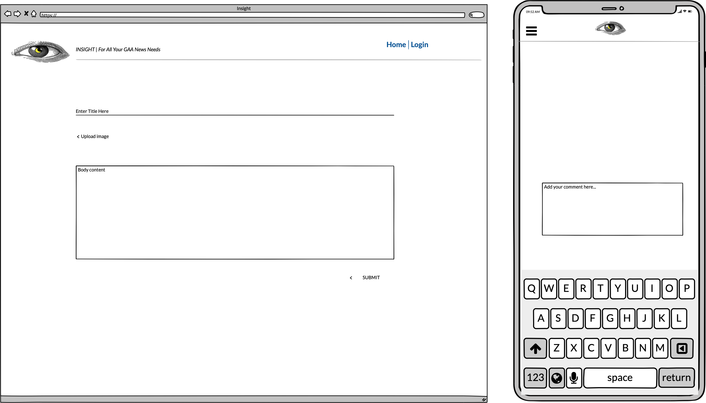

    
Create Comment

    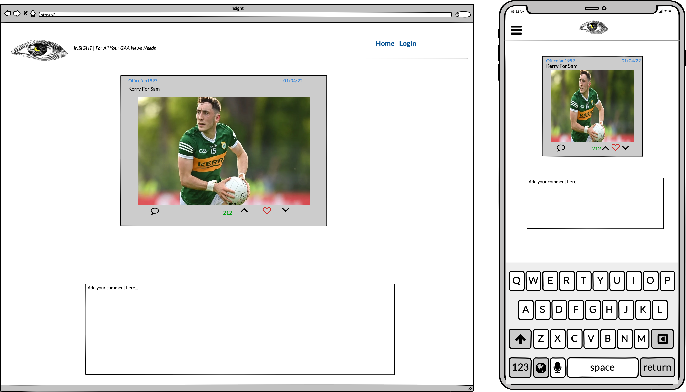

 

## Logo
The Logo was taken from [webhostingsecretrevealed](https://www.webhostingsecretrevealed.net/blog/web-design/free-beautiful-logos/).

    
View Logo

    

 

## Colour Scheme
The colour palette was generated on [Coolers](https://coolors.co/).

    
View Colour Palette

    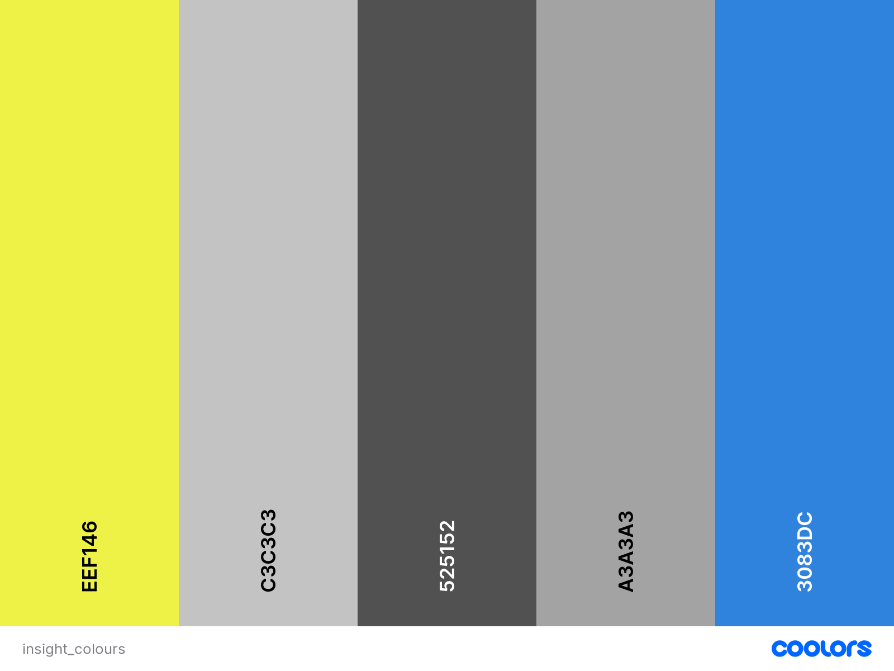

## Features
A users first time visiting the site they will be able to view posts on the homepage, expand the post to read it in full on the post detail page, view how many likes the post has and view the comments.

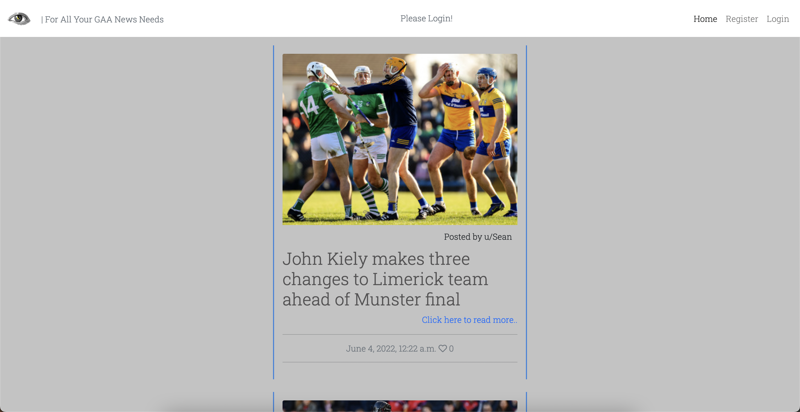
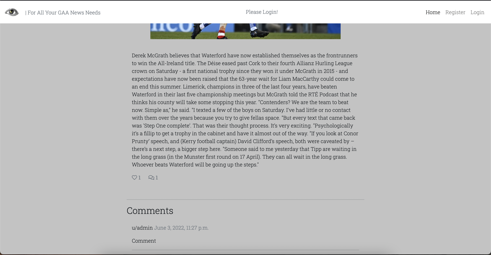

A user can Sign up to the website or Login if they already have an account. 

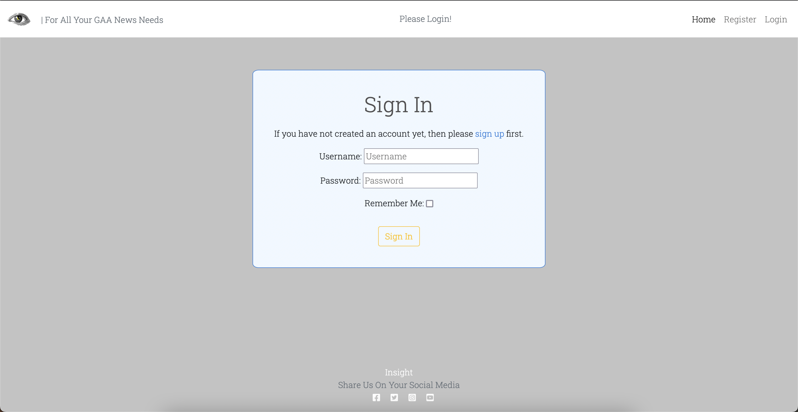

Logged in users can then create posts and comments and like posts.
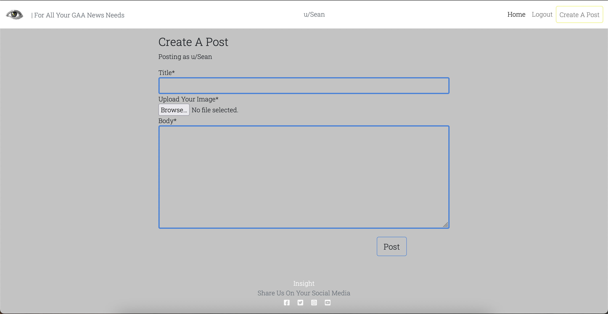

Users can Edit and Delete their posts when they are logged in.
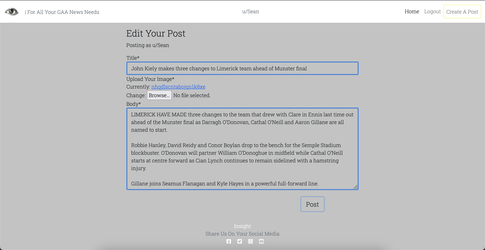
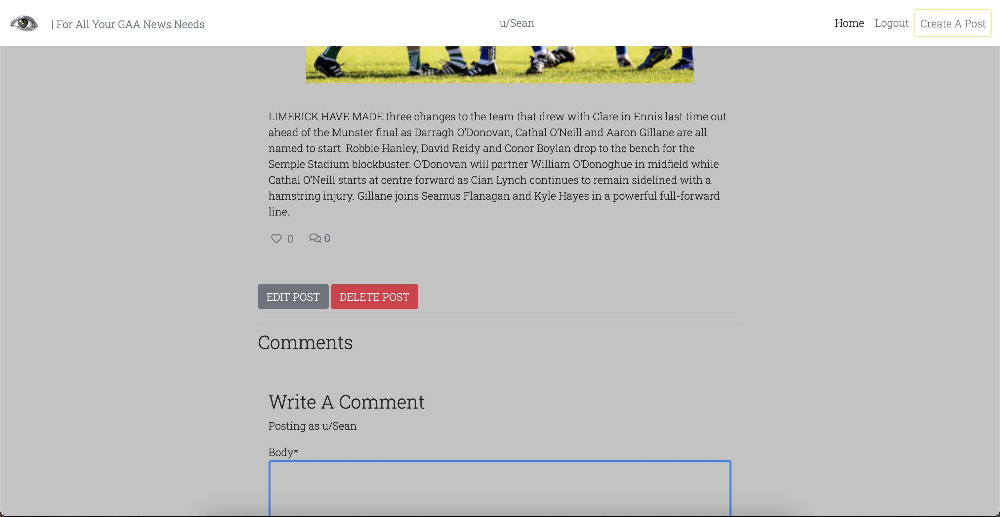

Posts will paginate into pages of 6.
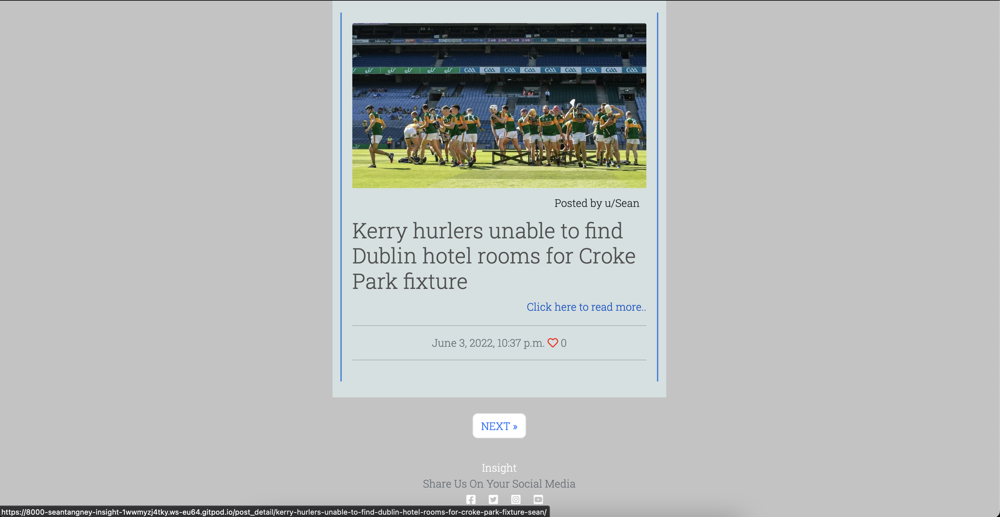

### Features i would like to implement in the future

-   I would like to implement different categories - Teams, Sports, Etc.
-   I would like to implement a search feaeture to look up relevant posts.

### Languages Used

-   HTML5
-   CSS3
-   Javascript
-   Python

## Technologies Used 

-   [Github](https://github.com/)
-   [Gitpod](https://gitpod.io/)
-   [Cloudinary](https://cloudinary.com/)
-   [Summernote](https://summernote.org/)
-   [Bootstrap](https://getbootstrap.com/)
-   [Balsamiq](https://balsamiq.com/)
-   [Django](https://www.djangoproject.com/)
-   [Gunicorn](https://gunicorn.org/)
-   [Font Awesome](https://fontawesome.com/)
-   [Google Fonts](https://fonts.google.com/)
-   [Coolers](https://coolors.co/)
-   [Am I responsive](https://ui.dev/amiresponsive)
-   [W3 Markup Validator](https://validator.w3.org/)
-   [W3 Css Validator](https://jigsaw.w3.org/css-validator/)

## Testing

I used W3 Css Validator to check my css for errors.
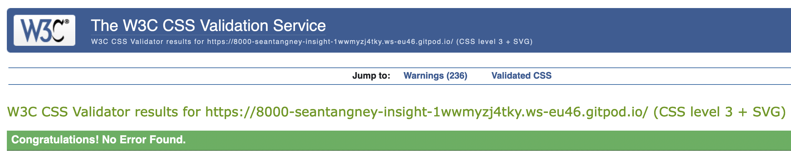

I used W3 Markup Validator to check my HTML for errors
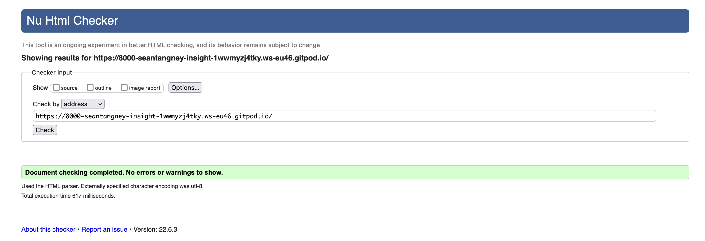

All user stories have expected functionality except for edit and delete posts.

## Bugs

-   When you edit a post and click submit. The redirect link throws an error. This is unresolved. The post does still edit as it should.

- Delete functionality on a post is not working.

## Deployment

I used Github and Heroku to deploy my website.

## Credits

- Tutors at CodeInstitute for their help with errors.
- My mentor for feedback.

