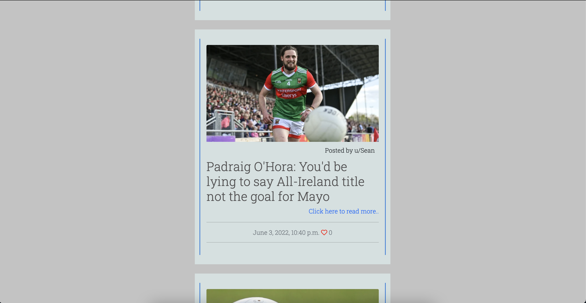
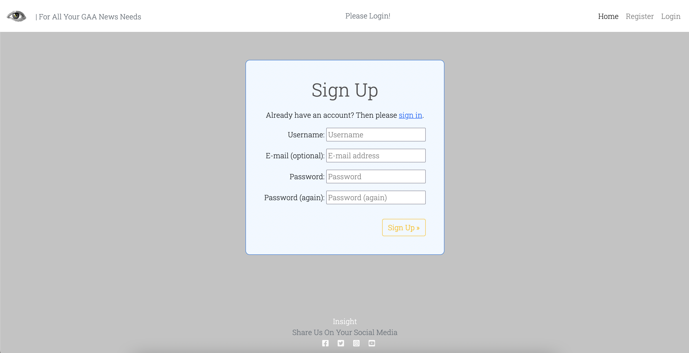

<h1 align="center">Insight - News Website</h1>

This is a Reddit style news site for all things GAA related

<h2 align="center"></h2>
<h2 align="center"></h2>

## User Experience (UX)
 

-   ### User Stories
    -   #### First Time Visitor Goals  

        1. As a First Time Visitor, I want to be able to view a list of posts so i can select one to read.
        2. As a First Time Visitor, I want to be able to view the number of likes so i can see how popular a post is.
        3. As a First Time Visitor, I want to be able to create an account on the website.
        4. As a First Time Visitor, I want to be able to like and comment on posts.
        5. As a First Time Visitor, I want to be able to unlike and edit/delete posts.
        

    -   #### Returning Visitor Goals

        1. As a Returning Visitor, I want to be able to log in to my account.
        2. As a Returning Visitor, I want to see if there are any newly added posts.
        3. As a Returning Visitor, I want to be able to create posts.

    -   #### Frequent Visitor Goals

        1. As a Frequent Visitor, I want to be able to log in to my account.
        2. As a Frequent Visitor, I want to see if there are any newly added posts.
        3. As a Frequent Visitor, I want to be able to create new posts.
        4. As a Frequent Visitor, check how popular my posts have gotten.

    -   #### Site Maintainer / Admin Goals

        1. As an Admin of the site i want to be able to see how many users have accounts.
        2. As an Admin of the site i want to be able to see all posts and comments.
        3. As an admin of the site i want to be able to edit delete any posts or comments by any user.

## Planning and Design 
 

## Wireframes
The wireframes were created using [Balsamiq](https://balsamiq.com/).

    
Click here to see wireframes.

     

    
Homepage

    

    
Sign Up

    

    
Sign In

    

    
Post Detail

    

    
Edit Post

    

    
Create Comment

    

 

## Logo
The Logo was taken from [webhostingsecretrevealed](https://www.webhostingsecretrevealed.net/blog/web-design/free-beautiful-logos/).

    
View Logo

    

 

## Colour Scheme
The colour palette was generated on [Coolers](https://coolors.co/).

    
View Colour Palette

    

## Features
A users first time visiting the site they will be able to view posts on the homepage, expand the post to read it in full on the post detail page, view how many likes the post has and view the comments.

A user can Sign up to the website or Login if they already have an account. 

Logged in users can then create posts and comments and like posts.

Users can Edit and Delete their posts when they are logged in.

Posts will paginate into pages of 6.

### Features i would like to implement in the future

-   I would like to implement different categories - Teams, Sports, Etc.
-   I would like to implement a search feaeture to look up relevant posts.

### Languages Used

-   HTML5
-   CSS3
-   Javascript
-   Python

## Technologies Used 

-   [Github](https://github.com/)
-   [Gitpod](https://gitpod.io/)
-   [Cloudinary](https://cloudinary.com/)
-   [Summernote](https://summernote.org/)
-   [Bootstrap](https://getbootstrap.com/)
-   [Balsamiq](https://balsamiq.com/)
-   [Django](https://www.djangoproject.com/)
-   [Gunicorn](https://gunicorn.org/)
-   [Font Awesome](https://fontawesome.com/)
-   [Google Fonts](https://fonts.google.com/)
-   [Coolers](https://coolors.co/)
-   [Am I responsive](https://ui.dev/amiresponsive)
-   [W3 Markup Validator](https://validator.w3.org/)
-   [W3 Css Validator](https://jigsaw.w3.org/css-validator/)

## Testing

I used W3 Css Validator to check my css for errors.
- I pasted my css code into the direct input box and it returned no errors.

I used W3 Markup Validator to check my HTML for errors
- I pasted the html from source code of every page on the site and after a couple of changes, it retured no errors via direct input.

# Website Manual Testing
## All Listed Tests Were Performed By Me.

1. Mouse will turn to pointer when hovering over links.
2. All Navbar links are working.
3. Navbar will display "Please Login" to users that havnt signed in to an account.
4. Navbar will display username when a user is signed in to their account.
5. Users are able to see post images, titles, likes, authors and creation date of each post on the main page.
6. The links to the post detail pages work.
7. Post detail page shows the full article content and comments.
8. Unauthorised user are unable to comment or like a post.
9. Liking a post will update the like-count on the mainpage and the post detail page.
10. The site will paginate and add a next page button at the bottom when there is more than 6 posts.
11. Users get a sign in success toast.
12. The login button changes to a logout button upon authorisation.
13. If the authorised user created a post they get the edit and delete buttons.
14. If a post is made without adding an image, the site logo will be dislayed on the main page but not in the post detail.
15. Users can create a post using the button in the navbar.
16. The logout button will ask to confirm and give a success toast on confirmation.
17. All footer links work and open in a new tab.
18. The django admin panel updates accordingly when information is changed.

# Testing User Stories from UX Section

-   ## First Time Visitor Goals

1. As a First Time Visitor, I want to be able to view a list of posts so i can select one to read.

    - As a first time visitor on the site , the first thing you will see is a a list of posts that you can select to read.

2. As a First Time Visitor, I want to be able to view the number of likes so i can see how popular a post is.

    - As a first time visitor on the site , whether you're looking at the index.html or at the post_detail.html you will be able to see how many likes a particular post has.

3. As a First Time Visitor, I want to be able to create an account on the website.

    - As a first time visitor on the site , you will be able to register for an account by pressing the register button on the navbar.

4. As a First Time Visitor, I want to be able to like and comment on posts

    - As a first time visitor on the site , if you have created your account, you will be able to like and comment on posts.

5. As a First Time Visitor, I want to be able to unlike and edit/delete posts.

    - As a first time visitor on the site , if you are signed in and have previously liked a post, you will be able to unlike it by pressing on it a second time. 

    - As a first time visitor on the site, if you are signed in and have previously created a post, you will be shown additional options on that post when you click in to read it in full. You can edit/delete the post from here.

-   ## Returning Visitor Goals

1. As a Returning Visitor, I want to be able to log in to my account.

    - As a Returning Visitor, I can navigate to the login page from the navbar and sign in to my account.

2. As a Returning Visitor, I want to see if there are any newly added posts.

    - As a Returning Visitor, I can see the newly added posts on the main page.

3. As a Returning Visitor, I want to be able to create posts.

    - As a Returning Visitor, if i have an account i can create posts.

-   ## Frequent Visitor Goals

1. As a Frequent Visitor, I want to be able to log in to my account.

    -  As a Frequent Visitor to the site i can log in if i have registered for an account.

2. As a Frequent Visitor, I want to see if there are any newly added posts.

    - As a Frequent Visitor to the site i can see on the main page any new posts that are added.

3. As a Frequent Visitor, I want to be able to create new posts.

    - As a Frequent Visitor to the site, once logged in i can create a new post by pressing on the create post button on the navbar.

4. As a Frequent Visitor, check how popular my posts have gotten.

    - As a Frequent Visitor to the site, i can see on the main page and on the post detail page how many likes a post has.

## Deployment

I used Github and Heroku to deploy my website.
- The steps i used are as follows:
    1. Check requirements.txt file by running the following command in the terminal: pip3 freeze > requirements.txt
    2. Check project has been fully committed and pushed to git.
    3. On heroku create a new app.
    4. Name your app.
    5. Go to settings
    6. Go to config vars and click reveal config vars
    7. Select python as a build pack.
    8. Select node.js and click save.
    9. Press deploy
    10. From the deployment method select GitHub
    11. Click connect to github.
    12. Search for your project name and connect to it.
    13. Deploy branch.
    14. Open App at the top.

I used cloudinary to host my staticfiles
- I updated my settings file with 
    1. Cloudinary to the INSTALLED_APPS list
    2. STATICFILE_STORAGE
    3. STATICFILES_DIRS
    4. STATIC_ROOT
    5. MEDIA_URL
    6. DEFAULT_FILE_STORAGE
    7. TEMPLATES_DIR
    8. Update DIRS in TEMPLATES with TEMPLATES_DIR
    9. Update ALLOWED_HOSTS with ['app_name.heroku.com', 'localhost']

## Media

- All Post Images and articles are from Rte.ie
- I think therefore i blog tutorial was used for setup and guidance.

## Credits

- Tutors at CodeInstitute for their help with errors.
- My mentor for feedback.

